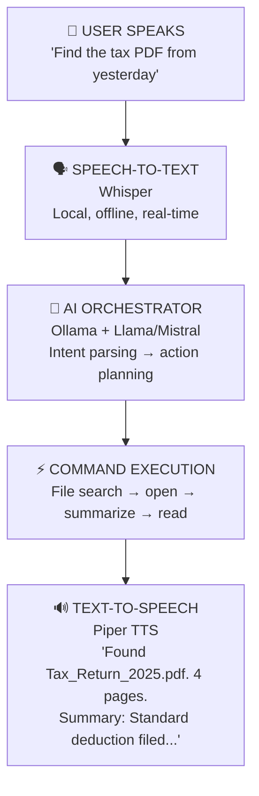

# Artume OS

<div align="center">

**A voice-native operating system for the blind. No screen reader. No visual interface. Just dialogue.**

*"Read to you, me."*

[](LICENSE)
[](https://www.python.org/)
[]()

</div>

---

## 🌙 The Name

**Artume** is the Etruscan goddess of the night — a deity who moved through darkness not with fear, but with clarity and purpose.

Phonetically: **R** (read) • **Tu** (to you) • **Me** (me)

*Read to you, me.* A dialogue. A handshake between human and machine, between the sighted world and those who navigate it through sound, touch, and language. That dialogue is what this project restores.

---

## 👁️ The Problem

Screen readers are the standard for blind computer access. They are also fundamentally broken.

Screen readers bolt audio output onto graphical interfaces that were never designed for people who cannot see. They read raw text aloud without understanding context. They cannot summarize a complex screen. They cannot anticipate intent. They cannot hold a conversation.

For a blind person, using a computer is not interaction — it is translation. Constant, exhausting, cognitive translation from a visual paradigm that was never theirs.

**43 million blind and low-vision people worldwide deserve better.**

---

## ⚡ What Artume Is

Artume is not a screen reader. It is a complete rethinking of what an operating system should be for people who navigate the world through sound and language.

| Traditional OS + Screen Reader | Artume |
|--------------------------------|--------|
| Visual desktop described aloud | No visual desktop at all |
| User memorizes keyboard shortcuts | User speaks naturally |
| Raw text dump of every UI element | Semantic summary of what matters |
| Reactive — responds to user navigation | Conversational — user states intent, AI acts |
| Cloud-dependent (most modern tools) | Fully local, fully private |
| Bolt-on accessibility | Built for blindness from the ground up |

---

## 🔄 How It Works



---

## 🌟 Key Architecture & Capabilities

```
                  ┌──────────────────────────────────────────────┐
                  │           Artume Voice OS Core               │
                  │   (Whisper STT / Piper TTS / Silero VAD)     │
                  └──────────────────────┬───────────────────────┘
                                         │
 ┌───────────────────┬───────────────────┼───────────────────┬───────────────────┐
 │                   │                   │                   │                   │
 ▼                   ▼                   ▼                   ▼                   ▼
🌐 Audio Browser    📧 Audio Mail       💻 Audio IDE        📁 File Manager     📝 Document Writer
(DuckDuckGo/DOM)   (IMAP/SMTP)         (AST Code Tree)     (Voice Tree)        (PDF/DOCX/MD/TXT)
 │                   │                   │                   │                   │
 ├───────────────────┼───────────────────┼───────────────────┼───────────────────┤
 ▼                   ▼                   ▼                   ▼                   ▼
📚 EBook Reader    ⚙️ Audio Settings   🎙️ Wake Word       🔊 Speech Barge-In  👁️ AT-SPI2 Screen Reader
(EPUB / PDF)        (Volume/Battery)    (Hey Artome)        (Instant Stop)      (Accessibility Tree)
```

---

## 📊 Current Project Status

| Module | File | Implementation Status | Features |
| :--- | :--- | :--- | :--- |
| **OS Core Daemon** | [`artome_core.py`](artome_core.py) | ✅ Fully Integrated | Multi-mode event loop, mode routing, earcons |
| **Audio Engine** | [`audio_engine.py`](audio_engine.py) | ✅ Fully Integrated | Piper TTS, continuous dynamic VAD, **Barge-In speech interruption** |
| **Earcons Engine** | [`earcons.py`](earcons.py) | ✅ Fully Integrated | Chimes for listening, thinking, success, error |
| **Wake-Word Detector**| [`wakeword_engine.py`](wakeword_engine.py) | ✅ Fully Integrated | Hands-free detection (*"Hey Artume"*, *"Computer"*, *"Hey R2"*) |
| **AT-SPI2 Screen Reader**| [`screen_reader.py`](screen_reader.py) | ✅ Fully Integrated | Linux `at-spi2-core` accessibility tree inspector |
| **AI Intent Router** | [`intent_router.py`](intent_router.py) | ✅ Fully Integrated | Ollama JSON structured intent schemas & `COMMAND:SCREEN_SUMMARY` |
| **Audio Web Browser** | [`browser_engine.py`](browser_engine.py) | ✅ Fully Integrated | DuckDuckGo audio web search, DOM article reading, links/headings |
| **Audio Email Client**| [`mail_engine.py`](mail_engine.py) | ✅ Fully Integrated | IMAP unread mail reader, voice dictation, SMTP sender |
| **Audio AI IDE** | [`ide_engine.py`](ide_engine.py) | ✅ Fully Integrated | Python AST code symbol navigator, function reader, traceback summarizer |
| **Audio File Manager**| [`file_browser_engine.py`](file_browser_engine.py) | ✅ Fully Integrated | Conversational directory tree navigator, audio file previews & search |
| **Document Writer** | [`doc_writer_engine.py`](doc_writer_engine.py) | ✅ Fully Integrated | Voice authoring, multi-format export (**PDF, Word DOCX, Markdown, TXT, HTML**), Dropbox sync |
| **EBook Reader** | [`ebook_engine.py`](ebook_engine.py) | ✅ Fully Integrated | EPUB & PDF audio reader, TOC chapter navigation, audio bookmarks, search |
| **System Settings** | [`system_settings_engine.py`](system_settings_engine.py) | ✅ Fully Integrated | Master volume control, battery % check, WiFi status, audio timers |
| **Command Navigator**| [`command_navigator.py`](command_navigator.py) | ✅ Fully Integrated | Context-aware audio help & 8-mode interactive audio OS menu |

---

## 🚀 Quickstart Guide

### 1. Prerequisites
Ensure system dependencies and local AI models are ready:
* Linux OS (Linux x86_64)
* Python 3.10+
* `piper` TTS binary and voice model (`en_US-lessac-medium.onnx`)
* `xdotool`, `aplay`, `amixer`
* Local `ollama` daemon running `tinyllama` or `llama3.2` model (`ollama run tinyllama`)

### 2. Running Artume OS
Run the main daemon from the virtual environment:

```bash
cd /home/damon/r2me
./venv/bin/python artome_core.py
```

---

## 🗣️ Voice Commands Reference Guide

### 1. Wake Word & Navigation
* **Wake Word**: `"Hey Artume"`, `"Artome"`, `"Computer"`, or `"Hey R2"`.
* **Toggle Wake Word**: `"Enable wake word"` or `"Disable wake word"`.
* **Audio Help**: `"Help"` or `"What can I say?"` (speaks mode-specific help).
* **Main Menu**: `"Main menu"` or `"Navigation menu"` (speaks 8-mode menu).
* **Barge-In**: Speak anytime while Artume is talking to instantly interrupt TTS and issue a new command.

### 2. Screen Reader & Perception
* `"What is on screen?"` / `"Read screen"` $\rightarrow$ Triggers AT-SPI2 accessibility tree inspection and speaks an AI-summarized screen description.

### 3. Audio Web Browser (`BROWSER` mode)
* `"Search for [query]"` $\rightarrow$ Searches DuckDuckGo and reads result summaries out loud.
* `"Open [URL]"` $\rightarrow$ Fetches and parses webpage into audio structure.
* `"Headings"` / `"Links"` $\rightarrow$ Lists headings or numbered links.
* `"Click link 1"` $\rightarrow$ Follows link by index.

### 4. Audio Email Client (`EMAIL` mode)
* `"Check inbox"` $\rightarrow$ Speaks unread email count and sender summaries.
* `"Read email 1"` $\rightarrow$ Speaks email body.
* `"Compose email"` $\rightarrow$ Initiates guided voice dictation and confirmation loop.

### 5. Audio AI IDE (`IDE` mode)
* `"Open code [file.py]"` $\rightarrow$ Parses Python AST and reads class/function outline.
* `"Read function [func_name]"` $\rightarrow$ Reads function source code out loud.
* `"Read lines 1 to 20"` $\rightarrow$ Reads line range.

### 6. Audio File Browser (`FILES` mode)
* `"Where am I"` $\rightarrow$ Speaks current directory location.
* `"List folders"` / `"List files"` $\rightarrow$ Speaks contents of current folder.
* `"Go to [folder]"` / `"Go up"` $\rightarrow$ Navigates folder tree.
* `"Search file [pattern]"` $\rightarrow$ Locates files across directory tree.

### 7. Document Writer (`DOCS` mode)
* `"New document [title]"` $\rightarrow$ Initializes new draft.
* `"Add heading [text]"` / `"Add paragraph [text]"` $\rightarrow$ Dictates text into draft.
* `"Export all"` $\rightarrow$ Simultaneously exports to **PDF, Word DOCX, Markdown, TXT, and HTML**.
* `"Share to cloud"` $\rightarrow$ Syncs exported files to Dropbox/cloud directory.

### 8. EBook Reader (`EBOOK` mode)
* `"Open book [file.epub / file.pdf]"` $\rightarrow$ Loads ebook and speaks chapter count.
* `"Read chapter [num]"` / `"Next chapter"` / `"Previous chapter"`.
* `"Set bookmark"` / `"Go to bookmark"`.
* `"Search book for [keyword]"` $\rightarrow$ Searches full text of book.

### 9. System Settings (`SETTINGS` mode)
* `"Status"` $\rightarrow$ Speaks time, date, battery level %, and WiFi network status.
* `"Volume up"` / `"Volume down"`.
* `"Set timer for [N] minutes"`.

---

## 🔮 Next Steps & Roadmap

- [ ] **Systemd Session Integration**: Package Artume as a systemd user service (`artome.service`) to auto-boot as the primary audio desktop session on startup.
- [ ] **Hardware Push-to-Talk & Panic Key**: Bind a physical keyboard key (`Caps Lock` or `Pause/Break`) to instantly toggle microphone mute or force-silence audio.
- [ ] **Bluetooth Audio Output Switcher**: Voice commands to switch audio output between built-in speakers, Bluetooth headsets, and USB DACs.
- [ ] **Multi-Language Speech Models**: Add support for non-English Whisper models and multilingual Piper TTS voices.
- [ ] **Offline LLM Fine-Tuning**: Fine-tune a lightweight 1B/3B local model specifically on Artume JSON action schemas for ultra-fast, offline inference.
